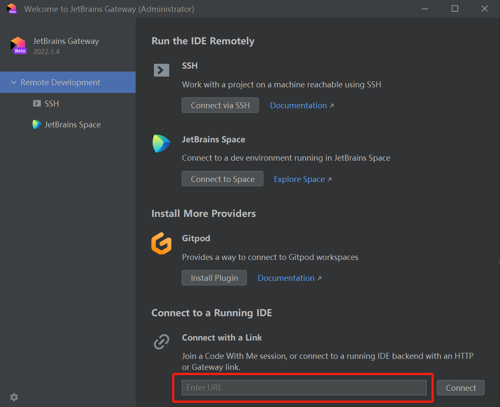

# Intellij IDEA

## Quickstart

1. Pack up the docker image
    ```bash
    docker build -t intellij-idea:2022.1.3-alpha .
    ```
1. Run the docker image in remote host (`{your-project-dir}` should be replaced based on your case)
    ```bash
    docker run -it --rm -p 5993:5993 -v {your-project-dir}:/workspace --name idea intellij-idea:2022.1.3-alpha
    ```
    Once ready, we should see a sample log snippet as
    ```bash
    *********************************************************

    Join link: tcp://0.0.0.0:5993#jt=0fb88860-356c-4c63-81cc-aac734a69eea&p=IU&fp=E43B29199F09AEC89BE39A058A72E456E8B2D1C5A629192CE0D68E81C466BF05&cb=221.5921.22&jb=11_0_15b2043.56

    Http link: https://code-with-me.jetbrains.com/remoteDev#idePath=%2Fidea&projectPath=%2Fworkspace&host=18eacf969ab1&port=22&user=root&type=ssh&deploy=false

    Gateway link: jetbrains-gateway://connect#idePath=%2Fidea&projectPath=%2Fworkspace&host=18eacf969ab1&port=22&user=root&type=ssh&deploy=false

    *********************************************************
    ```
1. Connect to started IDEA in local machine using JetBrains Gateway by filling modified value of `Join Link` into
   following box marked out by the red rectangle
     
   The value of `Join Link` is changed in such a way that the host part (i.e, `0.0.0.0` after `tcp://`) is replaced
   with the actual host or ip of the machine serving the container.
1. Change the default JDK in `Project Structure / Project Settings / Project / SDK` to the installed `1.8`

## References
- [2021.3 Headless server: Need a way to bypass "Press ENTER to continue"](https://youtrack.jetbrains.com/issue/GTW-936/20213-Headless-server-Need-a-way-to-bypass-Press-ENTER-to-continue)
- [Connect to a remote project at manually launched remote IDE (Server-to-client flow)](https://www.jetbrains.com/help/idea/2022.2/remote-development-a.html#use_idea)
- [Provide docker image for host](https://youtrack.jetbrains.com/issue/GTW-780/Provide-docker-image-for-host)
